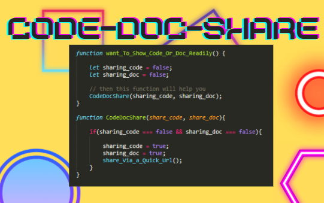
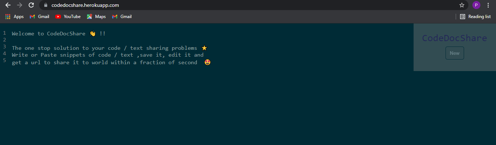
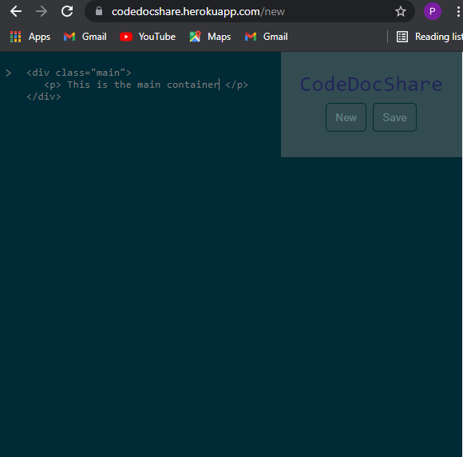
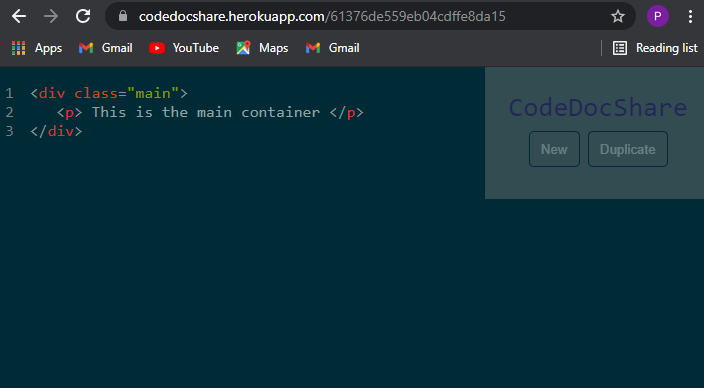
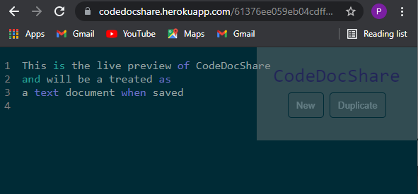

# CodeDocShare 👨‍💻📜📱

    

# 🚩 What Basically is CodeDocShare ? 🤔

CodeDocShare is full stack web application that simplifies the process of sharing Code Snippets and any text documents, readily via a URL generated within a fraction of second as soon as we save the snippet / doc . It also allows you to duplicate / edit if something is missed or misspelled and after changes you can again save and get a URL.
CodeDocShare also offers the functionality of detecting the snippet whether it's a code or a plain text

# 🚩Languages and Frameworks used :

   

# 🚩 Deployed on :

 

# 🧐 Preview of the application

 
    

 
    

 
    

 

 
    

# 🏍 To run the code locally :

 

- Clone / Download :

       git clone https://github.com/your_username/CodeDocShare.git

- Navigate to the CodeDocShare folder

       cd CodeDocShare

- Run the local version of application

       npm start

You are good to go now ... 😀

## ✍ Got any issue ? / Want to Contribute ? :

Contributions are what make the open source community such an amazing place to be learn, inspire, and create. Any contributions you make are greatly appreciated.

- Fork the Project
- Create your new Branch <code> git checkout -b NewBranchName </code>
- Commit your Changes <code> git commit -m " Description of contribution you made " </code>
- Push to the Branch <code> git push origin NewBranchName </code>
- Open a Pull Request

I'll review your suggestions / issues as soon as possible
